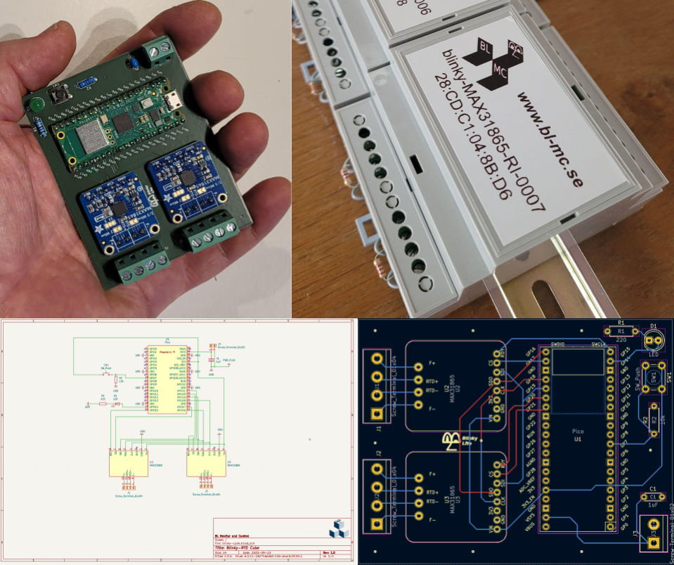

#    Blinky-MAX31864 Cube # 
The Blinky-MAX31865 cube is a precision 4 terminal resistance measurement device that integrates into a Blinky-Lite control platform. The cubes incorporates two [Adafruit MAX31865 breakout boards](https://www.adafruit.com/product/3648) providing two independent measurment channels with 15 bits of resolution

## Features: ##
- Seamless integration into the open source [Blinky-Lite control platform](https://www.blinky-lite.se/) 
- Wireless connection for data acquistion and control
- Web interface for wireless connection configuration
- Two independent channels
- Eighth order Chebyschev or power series temperature fit via web interface
- 100 mS pulsed measurements for low self heating
- User defined IIR filtering
- User defined measurement rate
- 15 bits of resolution

